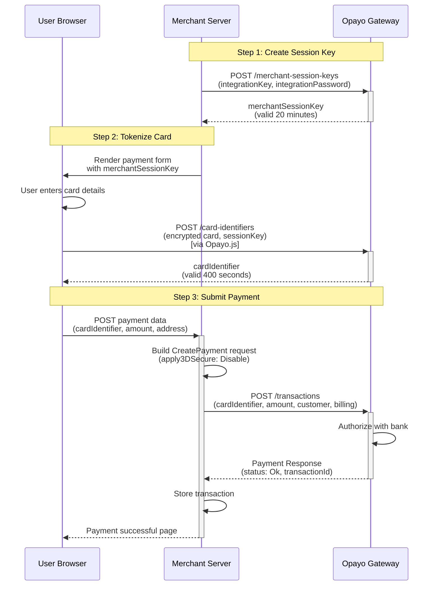
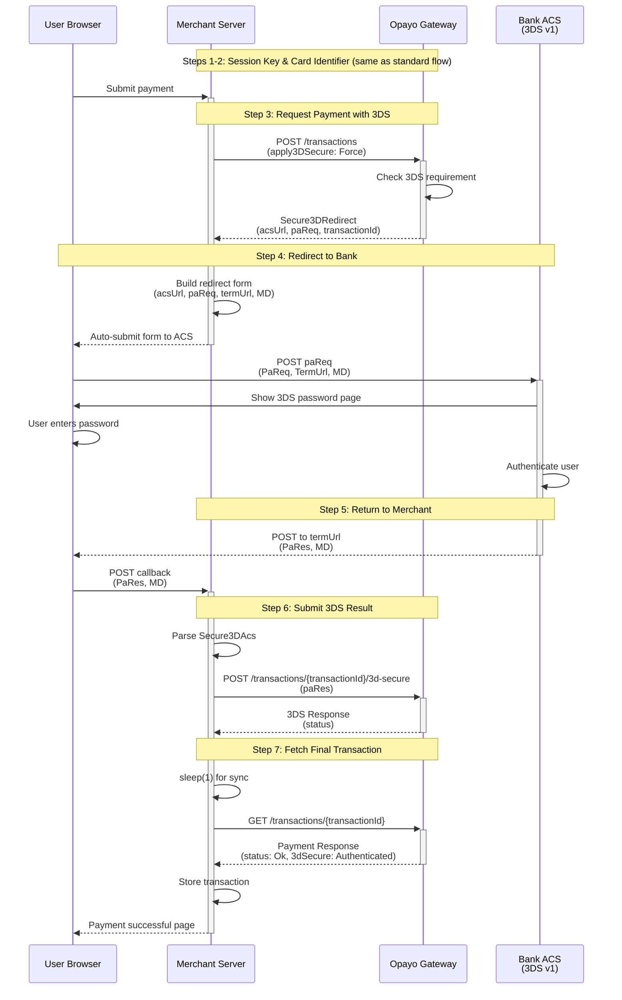
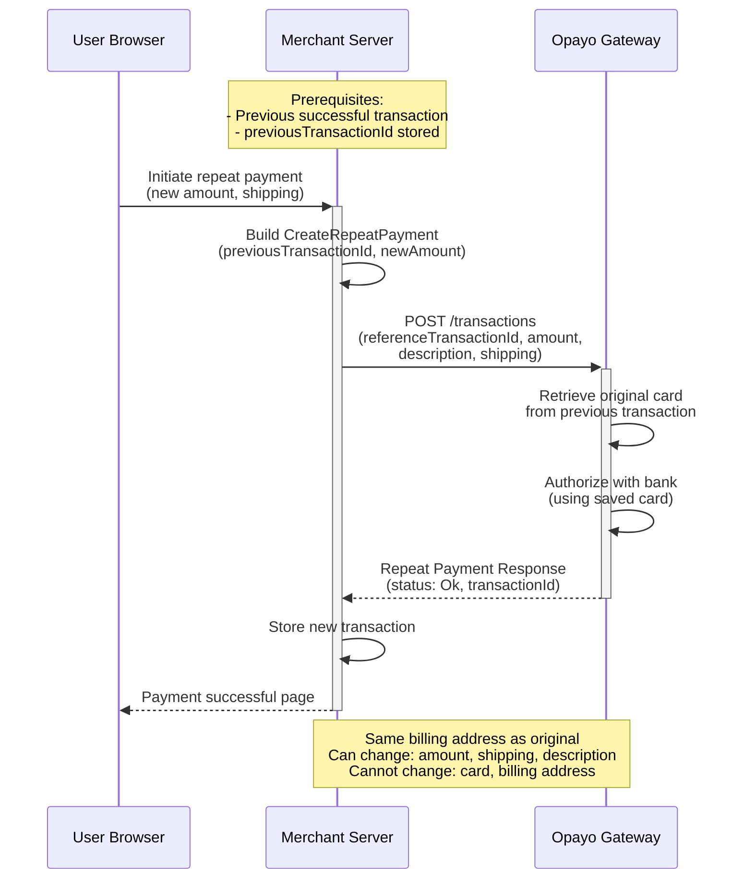
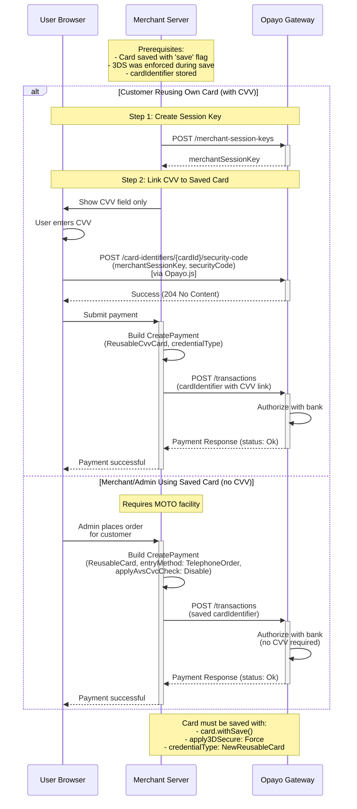
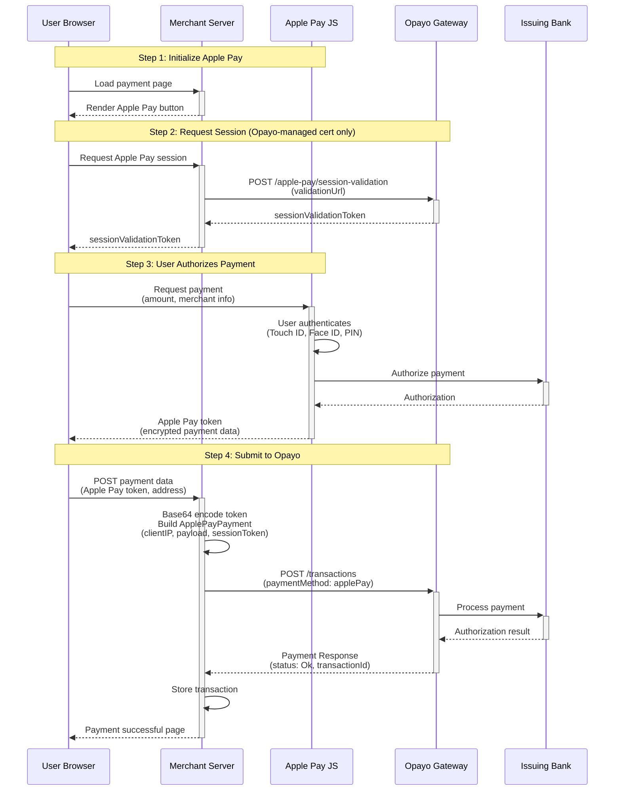
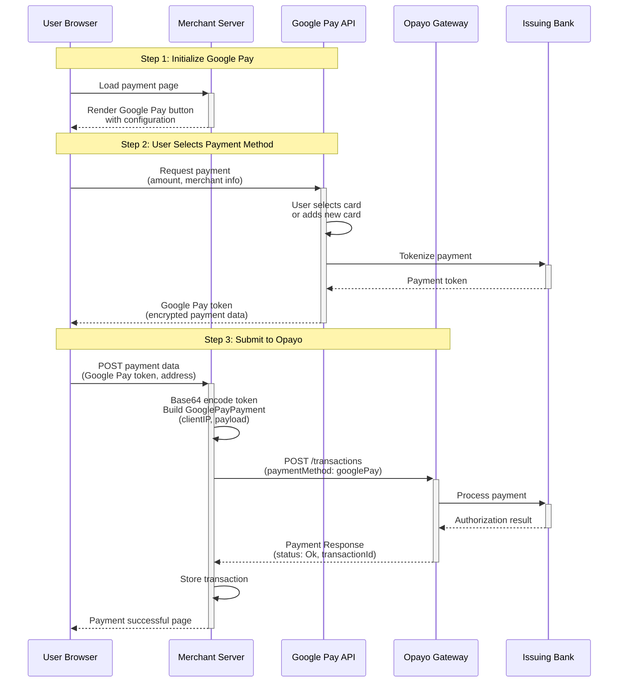
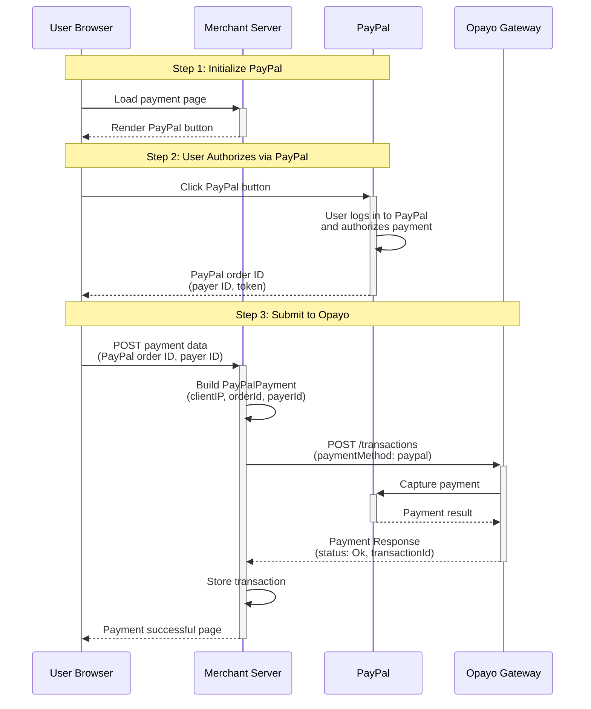

# Opayo Pi Payment Flow Diagrams

This document illustrates the complete payment flows for Opayo Pi integration using Mermaid sequence diagrams.

## Table of Contents

1. [Standard Payment Flow (No 3D Secure)](#standard-payment-flow-no-3d-secure)
2. [3D Secure Version 1 Flow](#3d-secure-version-1-flow)
3. [3D Secure Version 2 Flow (SCA)](#3d-secure-version-2-flow-sca)
4. [Repeat Payment Flow](#repeat-payment-flow)
5. [Saved Card Payment Flow](#saved-card-payment-flow)
6. [Alternative Payment Methods](#alternative-payment-methods)
   - [Apple Pay Flow](#apple-pay-flow)
   - [Google Pay Flow](#google-pay-flow)
   - [PayPal Flow](#paypal-flow)

---

## Standard Payment Flow (No 3D Secure)

This flow shows a basic payment without 3D Secure authentication.



---

## 3D Secure Version 1 Flow

Legacy 3D Secure flow (being phased out, replaced by v2).



---

## 3D Secure Version 2 Flow (SCA)

Modern 3D Secure flow with Strong Customer Authentication (mandatory worldwide).

```mermaid
sequenceDiagram
    participant Browser as User Browser
    participant Merchant as Merchant Server
    participant Opayo as Opayo Gateway
    participant ACS as Bank ACS<br/>(3DS v2)

    Note over Merchant,Opayo: Steps 1-2: Session Key & Card Identifier (same as standard flow)
    Browser->>+Merchant: Submit payment

    Note over Merchant,Opayo: Step 3: Request Payment with 3DS v2 + SCA
    Merchant->>Merchant: Build StrongCustomerAuthentication<br/>(notificationURL, browserInfo, IP)
    Merchant->>+Opayo: POST /transactions<br/>(apply3DSecure: Force, strongCustomerAuthentication)
    Opayo->>Opayo: Evaluate 3DS requirement<br/>(frictionless or challenge)

    alt Frictionless Flow (No Challenge)
        Opayo-->>Merchant: Payment Response<br/>(status: Ok, 3dSecure: Authenticated)
        Merchant-->>-Browser: Payment successful
    else Challenge Required
        Opayo-->>-Merchant: Secure3Dv2Redirect<br/>(acsUrl, cReq, transactionId)

        Note over Browser,ACS: Step 4: Redirect to Bank
        Merchant->>Merchant: Build redirect form<br/>(acsUrl, cReq, threeDSSessionData)
        Merchant-->>-Browser: Auto-submit form to ACS
        Browser->>+ACS: POST cReq<br/>(creq, threeDSSessionData)
        ACS->>Browser: Show 3DS v2 challenge<br/>(biometric, OTP, etc.)
        Browser->>Browser: User completes challenge
        ACS->>ACS: Authenticate user

        Note over ACS,Opayo: Step 5: ACS notifies Opayo directly
        ACS->>+Opayo: POST authentication result
        Opayo-->>-ACS: Acknowledgement

        Note over ACS,Merchant: Step 6: Redirect to Notification URL
        ACS-->>-Browser: Redirect to notificationURL<br/>(cRes, threeDSSessionData)
        Browser->>+Merchant: POST to notificationURL<br/>(cres, threeDSSessionData)

        Note over Merchant,Opayo: Step 7: Submit 3DS v2 Challenge Response
        Merchant->>Merchant: Parse Secure3Dv2Notification
        Merchant->>+Opayo: POST /transactions/{transactionId}/3d-secure-challenge<br/>(cRes)
        Opayo-->>-Merchant: Payment Response<br/>(status: Ok, 3dSecure: Authenticated)

        Merchant->>Merchant: Store transaction
        Merchant-->>-Browser: Payment successful page
    end
```

---

## Repeat Payment Flow

Reusing a previous transaction to charge the same card.



---

## Saved Card Payment Flow

Using a previously saved reusable card identifier.



---

## Alternative Payment Methods

Modern payment gateways support various digital wallet and alternative payment methods beyond traditional cards.

### Apple Pay Flow

Apple Pay integration with Opayo Pi.



**Key Apple Pay Details:**
- **Two Certificate Types**:
  - Opayo-managed: Easier setup, requires `sessionValidationToken`
  - Merchant-managed: Full control, requires Apple Developer account
- **Token Structure**: Payment data encrypted by Apple, contains card PAN, cryptogram
- **Base64 Encoding**: Apple Pay token must be Base64 encoded before sending to Opayo
- **Client IP Required**: Must send customer's IP address with payment

---

### Google Pay Flow

Google Pay integration with Opayo Pi.



**Key Google Pay Details:**
- **Simpler Setup**: No certificate management required
- **Token Structure**: Payment credentials encrypted by Google
- **Base64 Encoding**: Google Pay token must be Base64 encoded before sending to Opayo
- **Client IP Required**: Must send customer's IP address with payment
- **Browser Support**: Works on Chrome, Safari (limited), and Android

---

### PayPal Flow

PayPal integration with Opayo Pi (availability may vary).



**Key PayPal Details:**
- **Status**: PayPal Pi integration is being rolled out by Opayo
- **Setup Required**: Must enable PayPal in MyOpayo dashboard
- **No Card Details**: Customer never shares card info with merchant
- **Redirect Experience**: User completes payment on PayPal's site
- **Order ID**: PayPal provides order ID that must be captured via Opayo

**Note:** PayPal support in Opayo Pi API is currently limited. Check with Opayo support for current availability.

---

## Key Points & Notes

### Session Keys
- **merchantSessionKey**: Valid for 20 minutes
- Used to encrypt card data on client-side
- Created with `POST /merchant-session-keys`

### Card Identifiers
- **cardIdentifier**: Valid for 400 seconds (6.67 minutes)
- Tokenized card stored at Opayo
- Created with `POST /card-identifiers` (client-side via Opayo.js)

### 3D Secure Versions

| Feature | 3DS v1 | 3DS v2 |
|---------|--------|--------|
| Status | Legacy (phased out) | Current (mandatory) |
| Flow | Simple redirect | Frictionless or Challenge |
| Auth Methods | Password only | Biometric, OTP, App, Password |
| SCA Required | No | Yes (browser info, IP, etc.) |
| Notification | Direct callback | Via ACS acknowledgement |
| Return Data | PaRes, MD | cRes, threeDSSessionData |

### Transaction Types

| Type | Endpoint | Use Case |
|------|----------|----------|
| Payment | `POST /transactions` | New card payment |
| Repeat | `POST /transactions` | Reuse previous transaction card |
| Deferred | `POST /transactions` | Authorize now, capture later |
| Refund | `POST /transactions/{id}/instructions` | Refund settled transaction |
| Void | `POST /transactions/{id}/instructions` | Cancel before settlement |
| Release | `POST /transactions/{id}/instructions` | Capture deferred payment |
| Abort | `POST /transactions/{id}/instructions` | Cancel deferred payment |

### Payment Method Types

**Card Payment Methods:**

1. **SingleUseCard**
   - First-time card use
   - Requires merchantSessionKey + cardIdentifier
   - Tokenized, valid 400 seconds

2. **ReusableCard**
   - Previously saved card
   - No CVV required (MOTO facility needed)
   - For merchant-initiated transactions

3. **ReusableCvvCard**
   - Previously saved card with fresh CVV
   - Requires merchantSessionKey + cardIdentifier + CVV link
   - For customer-initiated repeat transactions

**Alternative Payment Methods:**

4. **ApplePayPayment**
   - Apple Pay digital wallet
   - Requires clientIpAddress + Base64-encoded token
   - Optional sessionValidationToken for Opayo-managed certificates
   - Supports Touch ID, Face ID authentication

5. **GooglePayPayment**
   - Google Pay digital wallet
   - Requires clientIpAddress + Base64-encoded token
   - No certificate management needed
   - Works on Chrome, Android devices

6. **PayPalPayment**
   - PayPal account payments
   - Requires clientIpAddress + PayPal order ID
   - Optional payer ID
   - Note: Limited availability in Pi API (being rolled out)

### Error Handling

All responses may return **ErrorCollection** instead of expected response:
- Check with `response->isError()`
- Iterate errors with `response->getErrors()`
- Each error has: code, property, description, clientMessage

### Best Practices

1. **Always use 3D Secure v2** (mandatory worldwide)
2. **Provide SCA data** for 3DS v2 (browser info, IP, etc.)
3. **Store transactionId** for future reference/repeat payments
4. **Sleep 1 second** after 3DS before fetching transaction (sync delay)
5. **Don't pass transactionId** as threeDSSessionData (causes rejection)
6. **Use vendorTxCode** for tracking (your internal unique ID)
7. **Validate address strictly** (Opayo has strict field validation)
8. **Handle expired tokens** (session keys, card identifiers have short lifespans)

---

## API Endpoints

**Base URLs:**
- Test: `https://pi-test.sagepay.com/api/v1`
- Live: `https://pi-live.sagepay.com/api/v1`

**Authentication:**
- Basic Auth: `integrationKey:integrationPassword`
- Base64 encoded in Authorization header

**Key Endpoints:**
```
POST   /merchant-session-keys                              Create session key
POST   /card-identifiers                                   Tokenize card
POST   /transactions                                       Create transaction
GET    /transactions/{transactionId}                       Fetch transaction
POST   /transactions/{transactionId}/3d-secure            Submit 3DS v1 result
POST   /transactions/{transactionId}/3d-secure-challenge  Submit 3DS v2 result
POST   /transactions/{transactionId}/instructions         Create instruction
POST   /card-identifiers/{cardId}/security-code           Link CVV to saved card
```

---

**Last Updated:** 2025-11-10
**API Version:** Opayo Pi v1
**Documentation:** https://developer-eu.elavon.com/docs/opayo
