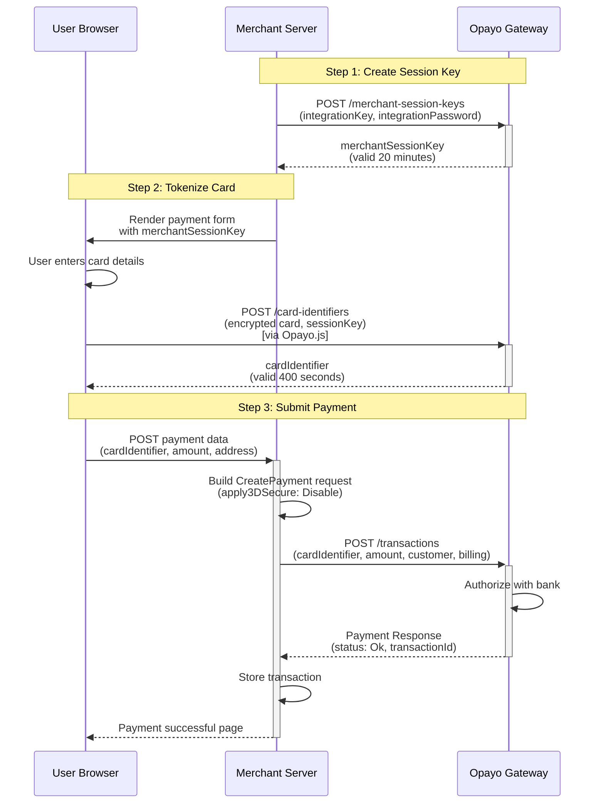
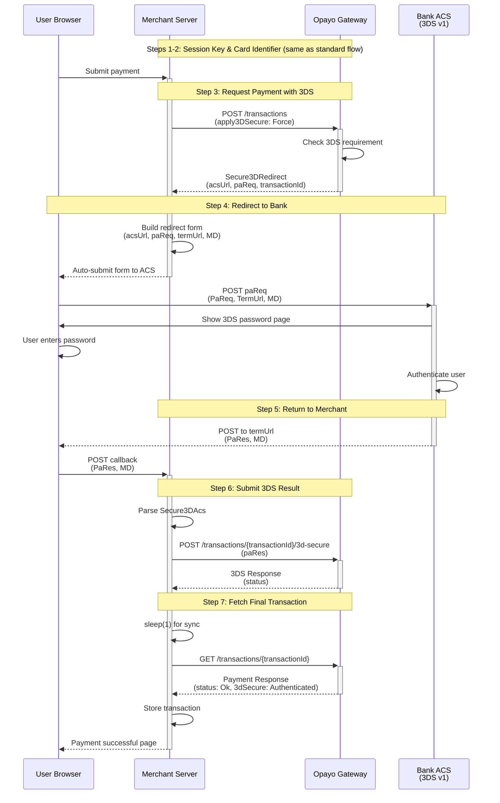
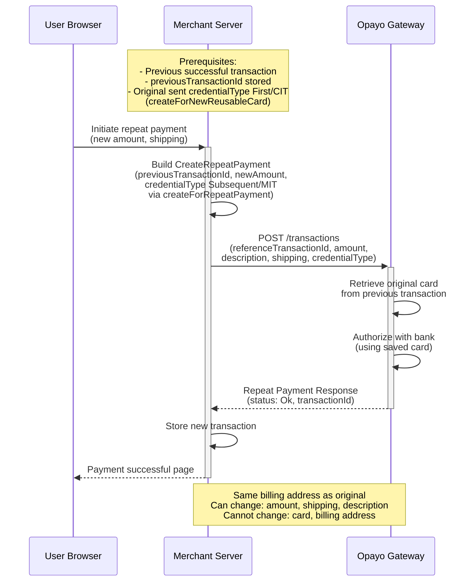
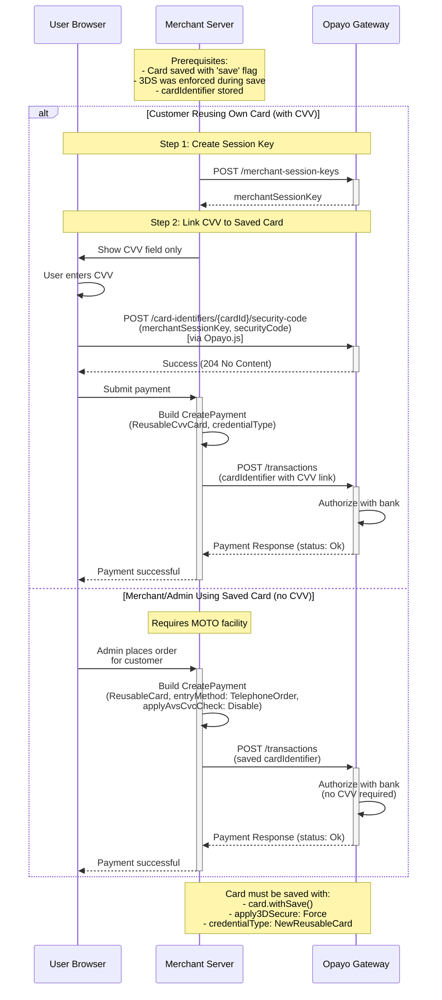
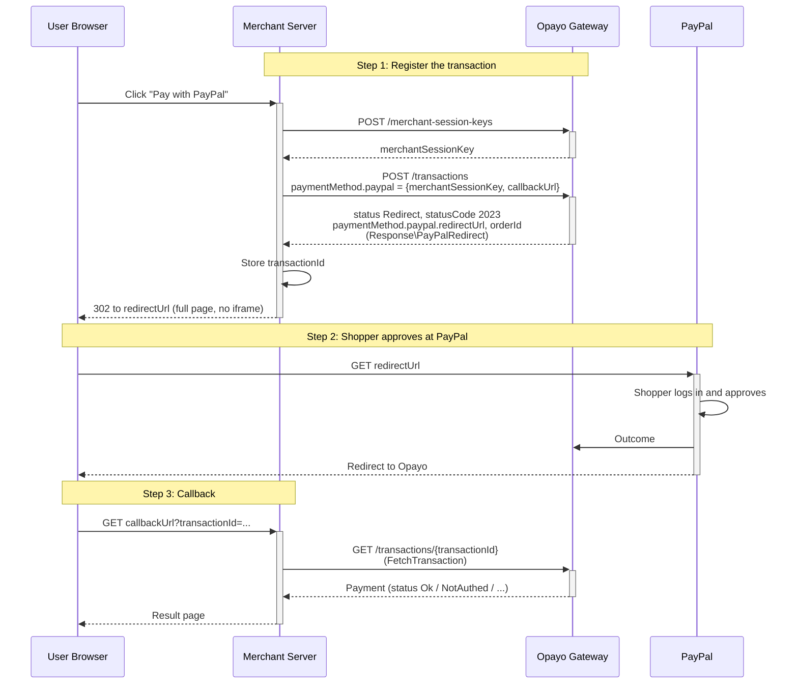
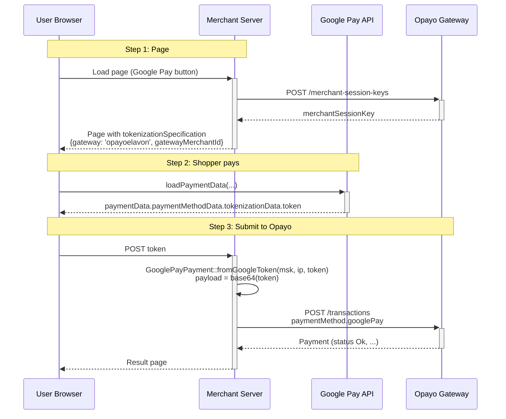

# Opayo Pi Payment Flow Diagrams

This document illustrates the complete payment flows for Opayo Pi integration using Mermaid sequence diagrams.

## Table of Contents

1. [Standard Payment Flow (No 3D Secure)](#standard-payment-flow-no-3d-secure)
2. [3D Secure Version 1 Flow](#3d-secure-version-1-flow)
3. [3D Secure Version 2 Flow (SCA)](#3d-secure-version-2-flow-sca)
4. [Repeat Payment Flow](#repeat-payment-flow)
5. [Saved Card Payment Flow](#saved-card-payment-flow)
6. [Alternative Payment Methods](#alternative-payment-methods)
   - [Apple Pay Flow](#apple-pay-flow)
   - [Google Pay Flow](#google-pay-flow)
   - [PayPal Flow](#paypal-flow)

---

## Standard Payment Flow (No 3D Secure)

This flow shows a basic payment without 3D Secure authentication.



---

## 3D Secure Version 1 Flow

Legacy 3D Secure flow (being phased out, replaced by v2).



---

## 3D Secure Version 2 Flow (SCA)

Modern 3D Secure flow with Strong Customer Authentication (mandatory worldwide).

```mermaid
sequenceDiagram
    participant Browser as User Browser
    participant Merchant as Merchant Server
    participant Opayo as Opayo Gateway
    participant ACS as Bank ACS<br/>(3DS v2)

    Note over Merchant,Opayo: Steps 1-2: Session Key & Card Identifier (same as standard flow)
    Browser->>+Merchant: Submit payment

    Note over Merchant,Opayo: Step 3: Request Payment with 3DS v2 + SCA
    Merchant->>Merchant: Build StrongCustomerAuthentication<br/>(notificationURL, browserInfo, IP)
    Merchant->>+Opayo: POST /transactions<br/>(apply3DSecure: Force, strongCustomerAuthentication)
    Opayo->>Opayo: Evaluate 3DS requirement<br/>(frictionless or challenge)

    alt Frictionless Flow (No Challenge)
        Opayo-->>Merchant: Payment Response<br/>(status: Ok, 3dSecure: Authenticated)
        Merchant-->>-Browser: Payment successful
    else Challenge Required
        Opayo-->>-Merchant: Secure3Dv2Redirect<br/>(acsUrl, cReq, transactionId)

        Note over Browser,ACS: Step 4: Redirect to Bank
        Merchant->>Merchant: Build redirect form<br/>(acsUrl, cReq, threeDSSessionData)
        Merchant-->>-Browser: Auto-submit form to ACS
        Browser->>+ACS: POST cReq<br/>(creq, threeDSSessionData)
        ACS->>Browser: Show 3DS v2 challenge<br/>(biometric, OTP, etc.)
        Browser->>Browser: User completes challenge
        ACS->>ACS: Authenticate user

        Note over ACS,Opayo: Step 5: ACS notifies Opayo directly
        ACS->>+Opayo: POST authentication result
        Opayo-->>-ACS: Acknowledgement

        Note over ACS,Merchant: Step 6: Redirect to Notification URL
        ACS-->>-Browser: Redirect to notificationURL<br/>(cRes, threeDSSessionData)
        Browser->>+Merchant: POST to notificationURL<br/>(cres, threeDSSessionData)

        Note over Merchant,Opayo: Step 7: Submit 3DS v2 Challenge Response
        Merchant->>Merchant: Parse Secure3Dv2Notification
        Merchant->>+Opayo: POST /transactions/{transactionId}/3d-secure-challenge<br/>(cRes)
        Opayo-->>-Merchant: Payment Response<br/>(status: Ok, 3dSecure: Authenticated)

        Merchant->>Merchant: Store transaction
        Merchant-->>-Browser: Payment successful page
    end
```

---

## Repeat Payment Flow

Reusing a previous transaction to charge the same card.



---

## Saved Card Payment Flow

Using a previously saved reusable card identifier.



---

## Alternative Payment Methods

Opayo Pi accepts Apple Pay, Google Pay and PayPal as the `paymentMethod` of a
payment. Every wallet object carries a `merchantSessionKey` (created with
`CreateSessionKey`, as for cards), and the wallet must be enabled on the vendor
in MyOpayo (Settings → Pay Methods); otherwise the gateway answers
`6401 Wallet not enabled for the vendor` / `1030 Vendor not enrolled with this
wallet type`. Field names below are from the Opayo API reference and were
verified against the sandbox.

### PayPal Flow

A redirect flow. Only the public `sandbox` vendor has PayPal enabled among the
sandbox profiles; the demo (`demo/paypal.php`) runs this flow.



**Key PayPal Details:**
- **Request**: `PayPalPayment($merchantSessionKey, $callbackUrl)` — nothing else;
  the PayPal order ID is returned by Opayo, not sent by you
- **Response**: `PayPalRedirect` (`getRedirectUrl()`, `getOrderId()`, `isRedirect()`);
  `TransactionStatus::REDIRECT` is not a final state
- **Timing**: the merchant session key expires after 400 s; the shopper must be
  redirected to PayPal within 20 minutes
- **Callback**: Opayo appends the Opayo `transactionId` to `callbackUrl`; nothing
  about the outcome is in the URL — fetch the transaction. Until PayPal has
  reported back, `GET /transactions/{id}` answers `404 Transaction not found`
  (1012); the transaction becomes fetchable when the shopper finishes at PayPal
- **Refunds**: PayPal transactions are refunded via the API, not MyOpayo
- **Setup**: onboard your PayPal business account to Opayo (sandbox or live link
  in Opayo's PayPal guide) and add the PayPal email in MyOpayo → Pay Methods

---

### Apple Pay Flow

Apple Pay needs Safari on an Apple device; the token cannot be produced
server-side, so this flow cannot be exercised by the demo.

```mermaid
sequenceDiagram
    participant Browser as Safari (Apple Pay JS)
    participant Merchant as Merchant Server
    participant Opayo as Opayo Gateway
    participant Apple as Apple

    Note over Browser,Merchant: Step 1: Payment sheet
    Browser->>+Merchant: Load page (show Apple Pay button)
    Merchant->>+Opayo: POST /merchant-session-keys
    Opayo-->>-Merchant: merchantSessionKey
    Merchant-->>-Browser: Page

    Note over Browser,Opayo: Step 2: Merchant validation (Opayo-managed certificate only)
    Browser->>Browser: new ApplePaySession(...); onvalidatemerchant
    Browser->>+Merchant: Request merchant session
    Merchant->>+Opayo: POST /applepay/sessions<br/>{vendorName, domainName} (CreateApplePaySession)
    Opayo->>Apple: Validate merchant (Opayo's certificate)
    Opayo-->>-Merchant: merchant session + sessionValidationToken<br/>(Response\ApplePaySession)
    Merchant->>Merchant: Keep sessionValidationToken
    Merchant-->>-Browser: getMerchantSession() JSON
    Browser->>Browser: session.completeMerchantValidation(...)

    Note over Browser,Apple: Step 3: Shopper authorises
    Browser->>Apple: Face ID / Touch ID
    Apple-->>Browser: onpaymentauthorized: event.payment.token

    Note over Browser,Opayo: Step 4: Submit to Opayo
    Browser->>+Merchant: POST token
    Merchant->>Merchant: ApplePayPayment::fromAppleToken(msk, ip, token, sessionValidationToken)<br/>paymentData = base64({"paymentData": ...})
    Merchant->>+Opayo: POST /transactions<br/>paymentMethod.applePay
    Opayo-->>-Merchant: Payment (status Ok, ...)
    Merchant-->>-Browser: {approved: true/false} -> session.completePayment(...)
```

**Key Apple Pay Details:**
- **Fields**: `merchantSessionKey`, `clientIpAddress`, `paymentData` (base64 of
  Apple's paymentData **including the top-level node**), `sessionValidationToken`
  (Opayo-managed certificate only), optional `applicationData`, `displayName`,
  `paymentMethodType`
- **Opayo-managed certificate**: register your HTTPS domain in MyOpayo (Apple's
  `.well-known/apple-developer-merchantid-domain-association` file must be served
  on live; not required by Apple in the sandbox) and call
  `CreateApplePaySession` from `onvalidatemerchant`
- **Merchant-managed certificate**: Apple merchant ID + Opayo-issued CSR signed
  by Apple and uploaded to MyOpayo; no session call
- **Sandbox**: merchant-managed only, with Apple sandbox test cards; magic
  amounts `10600` (authorised), `10700` (soft decline), `10800` / `10900`
  (authorised with ecommerce-type change); `POST /applepay/sessions` needs a
  registered domain (`6118 Domain not registered` otherwise)
- **Addresses**: Opayo uses the billing/shipping addresses in your request, not
  those chosen on the Apple Pay sheet

---

### Google Pay Flow

Google Pay needs the Google Pay sheet in a browser with a Google account; the
token cannot be produced server-side, so this flow cannot be exercised by the demo.



**Key Google Pay Details:**
- **Fields**: `merchantSessionKey`, `clientIpAddress`, `payload` (base64 of the
  tokenizationData token)
- **Gateway**: `gateway: 'opayoelavon'`; `gatewayMerchantId` shown in MyOpayo when
  you add Google Pay
- **Billing address**: taken from your request, not from Google's payload;
  CV2 is not applicable
- **Sandbox**: validates the payload (`6203 Invalid Google Pay payload` for
  anything but a real token)

---

## Key Points & Notes

### Session Keys
- **merchantSessionKey**: Valid for 20 minutes
- Used to encrypt card data on client-side
- Created with `POST /merchant-session-keys`

### Card Identifiers
- **cardIdentifier**: Valid for 400 seconds (6.67 minutes)
- Tokenized card stored at Opayo
- Created with `POST /card-identifiers` (client-side via Opayo.js)

### 3D Secure Versions

| Feature | 3DS v1 | 3DS v2 |
|---------|--------|--------|
| Status | Legacy (phased out) | Current (mandatory) |
| Flow | Simple redirect | Frictionless or Challenge |
| Auth Methods | Password only | Biometric, OTP, App, Password |
| SCA Required | No | Yes (browser info, IP, etc.) |
| Notification | Direct callback | Via ACS acknowledgement |
| Return Data | PaRes, MD | cRes, threeDSSessionData |

### Transaction Types

| Type | Endpoint | Use Case |
|------|----------|----------|
| Payment | `POST /transactions` | New card payment |
| Repeat | `POST /transactions` | Reuse previous transaction card |
| Deferred | `POST /transactions` | Authorize now, capture later |
| Refund | `POST /transactions/{id}/instructions` | Refund settled transaction |
| Void | `POST /transactions/{id}/instructions` | Cancel before settlement |
| Release | `POST /transactions/{id}/instructions` | Capture deferred payment |
| Abort | `POST /transactions/{id}/instructions` | Cancel deferred payment |

### Payment Method Types

**Card Payment Methods:**

1. **SingleUseCard**
   - First-time card use
   - Requires merchantSessionKey + cardIdentifier
   - Tokenized, valid 400 seconds

2. **ReusableCard**
   - Previously saved card
   - No CVV required (MOTO facility needed)
   - For merchant-initiated transactions

3. **ReusableCvvCard**
   - Previously saved card with fresh CVV
   - Requires merchantSessionKey + cardIdentifier + CVV link
   - For customer-initiated repeat transactions

**Alternative Payment Methods:**

4. **ApplePayPayment**
   - Apple Pay digital wallet
   - Requires merchantSessionKey + clientIpAddress + paymentData (Base64 of Apple's paymentData node)
   - sessionValidationToken required for Opayo-managed certificates (from `CreateApplePaySession`)
   - Optional applicationData, displayName, paymentMethodType; `fromAppleToken()` fills these from Apple's token

5. **GooglePayPayment**
   - Google Pay digital wallet
   - Requires merchantSessionKey + clientIpAddress + payload (Base64 of the tokenizationData token)
   - Gateway `opayoelavon` + gatewayMerchantId from MyOpayo in the Google Pay JS config

6. **PayPalPayment**
   - PayPal account payments (redirect flow)
   - Requires merchantSessionKey + callbackUrl
   - Response is `PayPalRedirect` (status Redirect / 2023) with the PayPal redirectUrl and orderId;
     fetch the transaction at the callback for the outcome

### Error Handling

All responses may return **ErrorCollection** instead of expected response:
- Check with `response->isError()`
- Iterate errors with `response->getErrors()`
- Each error has: code, property, description, clientMessage

### Best Practices

1. **Always use 3D Secure v2** (mandatory worldwide)
2. **Provide SCA data** for 3DS v2 (browser info, IP, etc.)
3. **Store transactionId** for future reference/repeat payments
4. **Sleep 1 second** after 3DS before fetching transaction (sync delay)
5. **Don't pass transactionId** as threeDSSessionData (causes rejection)
6. **Use vendorTxCode** for tracking (your internal unique ID)
7. **Validate address strictly** (Opayo has strict field validation)
8. **Handle expired tokens** (session keys, card identifiers have short lifespans)

---

## API Endpoints

**Base URLs:**
- Test: `https://sandbox.opayo.eu.elavon.com/api/v1`
- Live: `https://live.opayo.eu.elavon.com/api/v1`

**Authentication:**
- Basic Auth: `integrationKey:integrationPassword`
- Base64 encoded in Authorization header

**Key Endpoints:**
```
POST   /merchant-session-keys                              Create session key
POST   /applepay/sessions                                  Apple Pay merchant session (Opayo-managed certificate)
POST   /card-identifiers                                   Tokenize card
POST   /transactions                                       Create transaction
GET    /transactions/{transactionId}                       Fetch transaction
POST   /transactions/{transactionId}/3d-secure            Submit 3DS v1 result
POST   /transactions/{transactionId}/3d-secure-challenge  Submit 3DS v2 result
POST   /transactions/{transactionId}/instructions         Create instruction
POST   /card-identifiers/{cardId}/security-code           Link CVV to saved card
```

---

**Last Updated:** 2026-08-21
**API Version:** Opayo Pi v1 (OpenAPI spec v1.1.0)
**Documentation:** https://developer.elavon.com/products/en-uk/opayo/v1/opayo-pi
