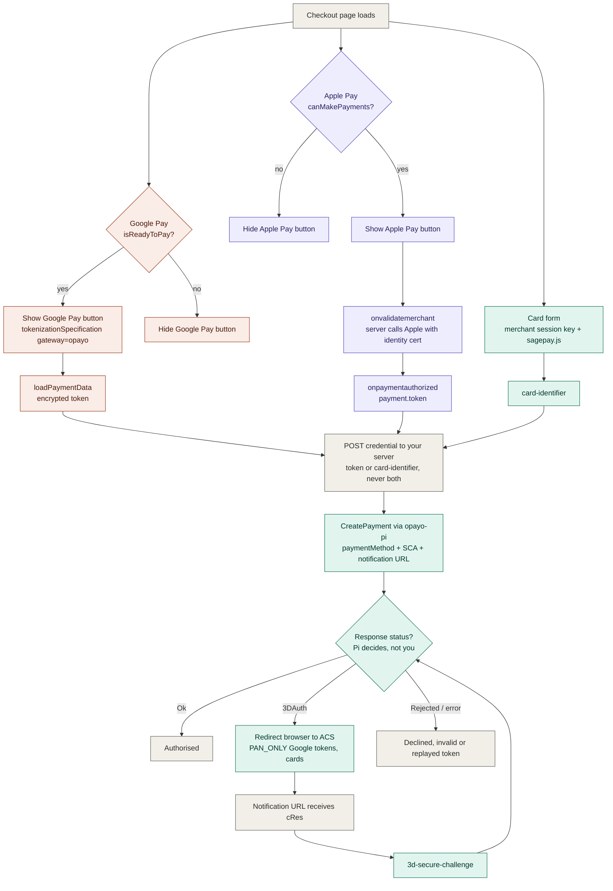
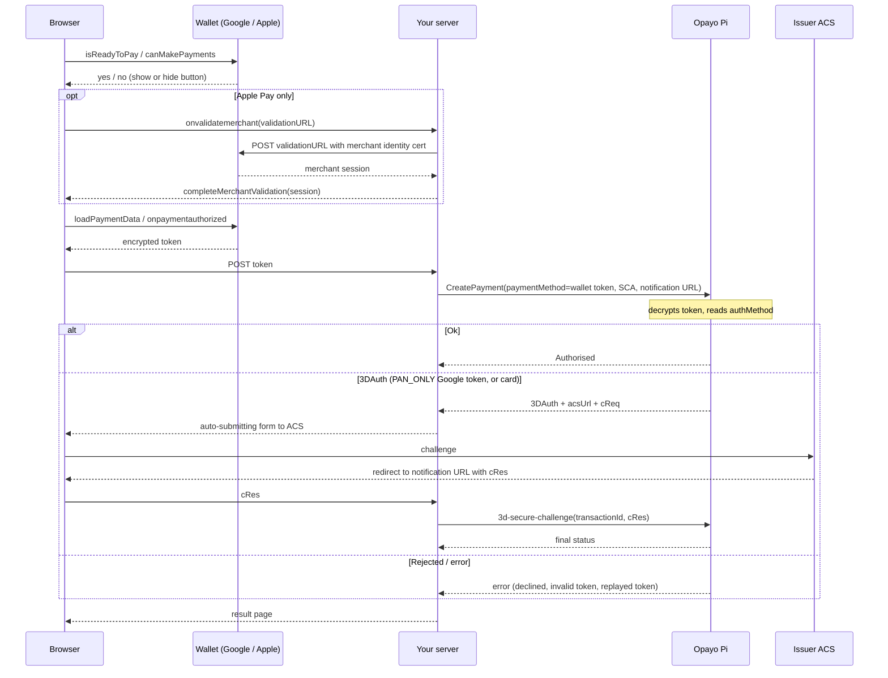

# academe/opayo-pi: wallet payments handover

Working notes for documenting and testing Google Pay and Apple Pay through Opayo Pi.
Diagrams are mermaid so they can be dropped straight into the README / demo branch.

## Status (implemented 2026-09-05)

The demo redesign is built (spec: `docs/superpowers/specs/2026-09-05-demo-all-payment-types-design.md`).
What changed against these notes:

- **Apple Pay uses the Opayo-managed certificate path** (`demo/apple-session.php`
  → `CreateApplePaySession`; no identity cert on our side, no
  `ApplePayMerchantValidation`-to-Apple message). **Caveat discovered Sept 2026:**
  Elavon support says the **test** environment supports only *merchant-managed*
  Apple Pay, so this Opayo-managed flow is production-only and returns `4006` on
  the sandbox. Exercising Apple Pay on test would need the merchant-managed
  validation flow (direct call to Apple with a merchant identity certificate),
  i.e. the `ApplePayMerchantValidation` message classes sketched below, which are
  still not built. It is also unconfirmed whether Opayo's merchant-managed test
  path covers web at all (their docs are In-App). See `docs/CREDENTIALS-AND-SETUP.md`.
- Demo files landed as `pay.php` (one endpoint), `apple-session.php`,
  `methods/{card,googlepay,applepay,paypal}.php`, not the `apple-validate.php` /
  `notify.php` / `result.php` split sketched under "Demo branch". `notification.php`
  and `paypal-return.php` (existing) are the callbacks.
- Google Pay request objects are built by the library
  (`Academe\Opayo\Pi\GooglePay\Configuration`), added earlier this branch.

Open points resolved:

- **(2) Does the Opayo test vendor accept Google TEST tokens?** No. The TEST sheet
  returns a genuine token, and the sandbox rejects it with `6203 Invalid Google
  Pay payload`. There is
  no sandbox path to a completed Google Pay payment. See
  `docs/google-pay-key-custody.html`.
- **(3) Apple payment-processing certificate / CSR.** Now relevant: on **test**
  (merchant-managed only) you download the CSR from MyOpayo, sign it at Apple, and
  upload it back. Opayo keeps the key. The certificate does not live only "at
  Opayo, invisibly" as first noted; on test you drive its creation via your Apple
  Merchant ID.

Still open: **(1)** exact Apple `paymentMethod` field names (the library models
`paymentData`; confirm on a real device), **(4)** whether Opayo ever returns
`3DAuth` for an Apple Pay token, **(5)** repeat/recurring from wallet parents,
**(6, new)** whether Opayo's merchant-managed Apple Pay on test supports the web
or only In-App. This blocks any sandbox Apple Pay demonstration until answered.

## Where the line is

The package's boundary is **the encrypted wallet token string**. Everything that produces
the token belongs to Google or Apple and runs in the browser (plus, for Apple only, one
server-to-server call). Everything after the token exists belongs to Opayo Pi and is
what this package models.

| Owned by | Steps | Package scope |
|---|---|---|
| Google | Merchant registration & production approval; `isReadyToPay`; button; `PaymentDataRequest` with `tokenizationSpecification` (`gateway`, `gatewayMerchantId`); `loadPaymentData` → `paymentMethodData.tokenizationData.token` | Documented as prerequisites; not code |
| Apple | Developer account, merchant ID, payment processing cert (CSR from Opayo; confirm), merchant identity cert, domain verification file at `/.well-known/apple-developer-merchantid-domain-association`; `ApplePaySession`; `onvalidatemerchant` → **your server** calls Apple's validation URL with the identity cert; `onpaymentauthorized` → `payment.token` | Prerequisites documented; **merchant validation request/response are package PSR-7 messages**: every server-side HTTP call the integration needs is modelled, whichever party it goes to |
| Opayo Pi | `CreatePayment` with a wallet `paymentMethod` (replaces merchant-session-key + `sagepay.js` + `card-identifier`), 3DS handling, transaction/status/error responses, follow-on release/abort/refund | In scope |
| Merchant (your code) | Show/hide wallet buttons on the readiness answers; post the token to your server; pass it into `CreatePayment`; handle whatever comes back exactly as for a card | Shown in demo branch |

The README needs to say this: you cannot read the token. Only Opayo
decrypts it, so **you cannot know in advance whether a Google Pay payment will need a
3DS challenge**. Always send `strongCustomerAuthentication` and the notification URL,
and handle a `3DAuth` response the same way as for a card.

## Flow diagram (all paths)

## Sequence diagram

Only four arrows touch Opayo through the package: `CreatePayment` and its response, `3d-secure-challenge`
and its response. The Apple merchant-validation call is the one extra server-side step, and
it goes to Apple, not Opayo, but the package models it too, so the consumer never hand-builds
an HTTP request anywhere in the flow.

## New message classes

Package principle: **every server-side HTTP call the integration needs has a PSR-7 request
class and a matching response class, regardless of the endpoint.** Browser-side JS stays out.

| Message | Direction | Notes |
|---|---|---|
| `CreatePayment` with Google Pay `paymentMethod` | → Opayo | Token string in; field names to confirm (open point 1) |
| `CreatePayment` with Apple Pay `paymentMethod` | → Opayo | Same; likely the raw `payment.token.paymentData` object JSON-encoded; confirm |
| `ApplePayMerchantValidation` request | → Apple | POST to the `validationURL` Safari supplies; body `merchantIdentifier`, `displayName`, `initiative: "web"`, `initiativeContext` (your domain). Needs client TLS with the merchant identity cert + key: the PSR-18 client carries the cert, the message class carries the body. Validate `validationURL` host is an `apple.com` domain before posting. |
| `ApplePayMerchantValidation` response | ← Apple | Opaque merchant session JSON, passed straight to `completeMerchantValidation()`; class just wraps it and exposes the raw payload |

Existing responses (`Payment`, `Secure3D`, error responses) should already cover the Opayo
side; check they don't assume `card` is present in `paymentMethod` when parsing.

## Test matrix

| Path | Expect | How to exercise |
|---|---|---|
| Google, CRYPTOGRAM_3DS token | Authorised, no redirect | Real Android + Chrome with a Wallet-tokenised card. Google TEST env cannot fake this. |
| Google, PAN_ONLY, frictionless | Authorised, no redirect | Desktop browser, card on file with Google account |
| Google, PAN_ONLY, challenged | 3DAuth → ACS → `3d-secure-challenge` → final status | Desktop, Opayo test cards that force a challenge |
| Apple Pay | Authorised, no redirect (device-tokenised, SCA already satisfied) | Safari on macOS/iOS with Sandbox tester account; verify Opayo never returns 3DAuth |
| Apple merchant validation failure | Session never opens | Wrong cert / unverified domain |
| Declined | Rejected status | Opayo test amounts / cards |
| Tampered token | Error | Flip a byte in the token before posting |
| Wrong `gatewayMerchantId` / merchant ID | Error | Mismatch between Google/Apple config and Opayo vendor |
| Replayed token | Error | Post the same token twice; they are single-use and short-lived |
| Deferred → release / abort | Works identically to card parent | Wallet parent transaction |
| Refund | Works identically to card parent | Wallet parent transaction |
| Repeat / token reuse from wallet parent | Probably unsupported; confirm and document | |

## Demo branch: what it needs to show

Plain PHP, no framework. One script per endpoint, a shared `bootstrap.php` for config and
the PSR-18 client, and a `.env`-style config file that is gitignored (certs and keys never
committed). Suggested files:

- `index.php`: checkout page with all three payment options
- `apple-validate.php`: `onvalidatemerchant` endpoint
- `pay.php`: accepts the credential and calls `CreatePayment`
- `notify.php`: 3DS notification URL, calls `3d-secure-challenge`
- `result.php`: final status display
- `.well-known/apple-developer-merchantid-domain-association`: served verbatim

Checklist:

- [ ] Config for Opayo vendor + integration key/password, Google merchant ID, Apple merchant ID and cert paths
- [ ] One checkout page rendering all three options, each shown/hidden by its readiness check
- [ ] Google `PaymentDataRequest` snippet with the Opayo `tokenizationSpecification`
- [ ] Apple: domain verification file served; `onvalidatemerchant` endpoint using the identity cert
- [ ] Single server endpoint accepting `{ googlePayToken | applePayToken | cardIdentifier }` and building the right `CreatePayment`
- [ ] Notification URL endpoint completing `3d-secure-challenge`, shared by all paths
- [ ] Result page showing final status, `transactionId`, `bankAuthCode`
- [ ] Follow-on actions (release/abort/refund) against the resulting transaction
- [ ] README "Before you start" sections for Google and Apple, then "You have a token, now:"

## Open points to verify against Opayo's docs

1. Exact `paymentMethod` field names for Google Pay and Apple Pay tokens in `/transactions`
   (developer.elavon.com/products/opayo/v1/google-pay and the Apple Pay equivalent; JS-rendered, read in a browser).
2. Whether the Opayo **test** vendor accepts Google TEST-environment tokens, or needs a live
   Google merchant ID pointed at the test vendor.
3. Apple payment-processing certificate: does Opayo supply the CSR (so Opayo holds the
   decryption key), and where it is uploaded in MyOpayo.
4. Whether Opayo ever returns `3DAuth` for an Apple Pay token.
5. Repeat / recurring support from wallet parents.
